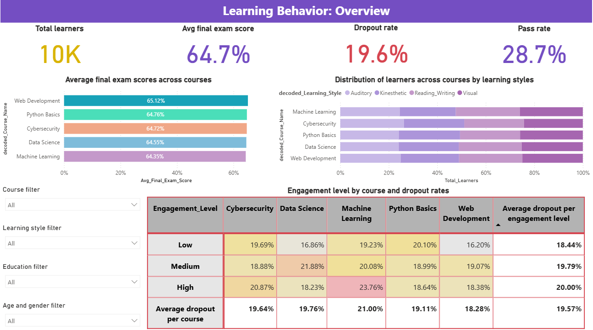
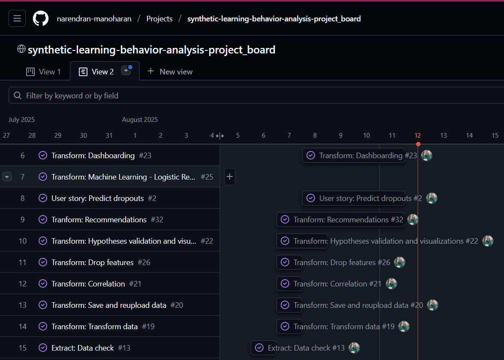

# Synthetic Learning Behavior Analysis
This project is designed to analyze learner behaviors, help draw useful insights, and enable informed decisions. While the project utilizes a synthetically generated dataset, it acts as a stepping stone in helping businesses understand what kind of learner behaviors impact engagement. It explores the possibility of creating learner clusters, which can enable personalized learning recommendations.

The analysis includes data extraction, transformation, visualization, statistical testing, and machine learning pipelines built using Python and its libraries such as Scikit-Learn and Feature-Engine. Additionally, I have explained basic concepts, justified the research methodology, explained the results, and contextualized why the results matter.

    

# 

## Table of Contents
- [Installation](#installation)
- [Dataset contents](#dataset-contents)
- [Business requirements](#business-requirements)
- [Project plan](#project-plan)
- [Research methodology](#research-methodologies)
- [Hypotheses and test results](#hypotheses-and-test-results)
- [Challenges](#challenges)
- [Ethical considerations](#ethical-considerations)
- [PowerBI Dashboard](#powerbi-dashboard)
- [Reflection](#reflection)
- [Notes](#notes)
- [Credits](#credits)

---

# Installation

Please use the requirements.txt document and install the required packages to run the project-work notebooks. During the course of the project, I had to install a couple of package. Following installation, I froze the requirements file.

## Code to install

pip install -r requirements.txt

# Dataset contents

- learner_id: Unique identifier for each learner

- engagement_score: Composite measure of interaction frequency

- time_on_task: Time spent on learning activities (minutes)

- quiz_scores: Assessment results over time

- difficulty_adjustment: Whether the system adjusted difficulty for the learner

- completion_status: Completed / In Progress / Dropped Out

# Business requirements

I decided to run the project to focus on the following requirements:

1. As a digital learning service provider, we want to group learners and enable adaptive learning experiences, so that we engage better with the existing users. 

2. As a program manager, I want to be able to predict dropout probability, so that we can engage with high-risk users. 

3. As an instructional design manager, I want to understand what factors impact engagement levels so that I can drive my team to design user-friendly learning experiences. 

4. As an instructional design manager, I want to analyze how learners choice of course and learning styles impact engagement level, so that we can adapt learning experiences. 

## Assumptions

1. The business intends to use synthetic data and build machine learning pipelines so that when real data becomes available, the logic from the pipelines can be used to draw insights from data.

2. Zero-value entries in the Forum_Participation column are valid.

3. Engagement_Level includes user activities such as:

    a. quiz activities(number of attempts, answers provided)

    b. assignment activities (how many assignments learners complete)

    c. the way learners leverage collateral educational resources (such as downloadable links, additional reading materials)

    d. interactivity data collated through xAPI

    e. forum participation

    f. questions asked or issues flagged (through the LMS or discussion forum)

4. Learning_Style is observed rather than self-assessed.

5. The bias in the dataset is alright for this sprint but needs to be handled in the next sprint.

6. The pass percentage on final exam score is 80%, which is an industry standard for the final assessments.

7. The responsibility to ensure engagement lies with the education service provider.

8. As the dataset is synthetic, inherently there are no ethical issues or privacy concerns associated with the data.

# Project plan

I leverage the GitHub project board to keep track of my work.

- I captured the user stories and broke down each task from the ETL pipeline to create a task list.
- At the end of each day, I tracked development and marked progressed by moving the tasks within the project board.
- I also added certain tasks during the actual development process.

    

Here are the broad steps that guided me through the ETL process:

 - Extraction: Downloaded the dataset from [Kaggle](https://www.kaggle.com/datasets/adilshamim8/personalized-learning-and-adaptive-education-dataset/data) and loaded it in VSCode.

 - Data exploration: Used Pandas to explore look for missing values, determine correlation, and detect outliers.

 - Initial visualizations: Used matplotlip and seaborn to visualize data during exploration.

 - Transformation: Encoded variables and transformed the data for further analysis.

 - Hypotheses testing: Determined the approapiate research methodology, tested the hypotheses, used Plotly to visualize the results, and explained what the results indicate.

 - Machine Learning: Built machine learning model pipelines.

 - Explnation: Explained the results and contextualized them for the business.

 - Dashboarding: Used PowerBI to narrate the story and enabled further data exploration.

 - Final load: Loaded the transformed dataset, completed a sanity check, summarized the ETL process, captured the next steps.

# Research methodologies

As the dataset was non-normally distributed, I used non-parametric test methods such as Mann-Whitney U-Test and Kruskal_Wallis Test.

I also leveraged Chi-Squared Test where I has to test categorical features. 

# Hypotheses and test results

Here is a table of the different hypotheses I created and the conclusion.

| Hypothesis                                                                 | Statistical Test      | p-value | Result/Conclusion                                      |
|----------------------------------------------------------------------------|-----------------------|--------|--------------------------------------------------------|
| Time spent on videos is associated with engagement level                   | Kruskal-Wallis        | 0.03   | Partial: Statistically significant relationship found but not observable relationship          |
| Learning style impacts engagement level                                    | Chi-Squared           | 0.99   | No significant relationship; null hypothesis accepted  |
| Forum participation impacts engagement level                               | Kruskal-Wallis        | 0.40   | No significant relationship; null hypothesis accepted  |
| Engagement level impacts dropout likelihood                                | Chi-Squared           | 0.33   | No significant relationship; null hypothesis accepted  |
| Course choice impacts feedback score                                       | Kruskal-Wallis        | 0.60   | No significant relationship; null hypothesis accepted  |
| Course choice impacts learning style                                       | Chi-Squared           | 0.70   | No significant relationship; null hypothesis accepted  |

# Challenges

As I was working with a synthetic dataset, the features were all independent from each other. This meant that the clustering and logistic regression models I build were overfitting and not ready for real-world applications.

I tried to use two more algorithms on my logistic regression classifieer (RandomForest and XGBoosting). However, the performance on these models were not significanlty different. The models continued overfitting. Consequently, I added a note saying that I will be removing these two algorithms as they do not extend the present value or add new value.

I have called these out clearly in the notebooks and emphasized it in all my explanation that the results are limited only to the observations in the synthetic dataset.

I have called out additional challenges in each notebook as they fit well over there contextually.

## Handling the challenges

While the dataset was engineered, I worked around the problem by:
- Calling out that the pipelines are not ready for generalization or real-world applications
- Contextualizing the results and explaining why the feature needs to be monitored and how to deal with any problems with the features in the real world

# Ethical considerations

- The analysis is based on a synthetic dataset, which avoids real-world privacy and ethical concerns.
- The dataset is biased but I have assumed that it is alright for the current sprint.
- All explanations and recommendations are restricted to synthetic data and do not generalize to real populations.
- Business recommendations highlight why certain features matter and suggest careful handling of sensitive issues when working with real data.
- Ethical risks are minimized, but I called out how the business should build the data collection process with privacy in mind.

# Main Analysis Tools

1. Pandas – Data cleaning & transformation
2. Matplotlib & Seaborn – Visual analysis
3. Plotly – Interactive visuals
4. SciPy & Scikit-learn – Statistical and predictive modelling
5. ChatGPT / GitHub Copilot – Idea generation, code optimization, documentation assistance

# PowerBI Dashboard

I used PowerBI to create a dashboard. The file is located within the [powerbi_dasboard](./powerbi_dashboard/)folder. Within this folder, I have also captured notes that helped me through the dashboarding process.

# Reflection

This project allowed me to dive deep into research methodologies and machine learning. I also understood the importance of having a clean, unbiased dataset to work with and how it impacts predictions. With the help of AI tools such as ChatGPT and GitHub Copilot I was able to augment learning and speed up development tasks. Some of my other key learnings include:

1. OneHot Encoding: Understood how and when to use it and its impact on the number of features
2. Research methodology: When to use Kruskal-Wallis Test and Chi-Squared Test and why.
3. ML pipeline: How to iteratively build a model considering the evaluation metrics and try different algorithms. I also understood how hyperparameter tuning helps handle these iterations.
4. ML pipeline functions: Creating functions are the easiest way to test multiple algorithms. This helped me test more than 3 algorithms within a quick time frame.
5. Dashboarding: I used multiple DAX queries to create new measure and columns on PowerBI. This experience helped me extend what I knew about PowerBI. 

## Future learning

I want to continue this learning experience by focusing on:

1. ML pipelines: How to iteratively build a model in challenging situations like the current project
2. Cleaning datasets, especially handling biased data
3. Honing my dashboarding skills
4. Understanding more about feature engineering

# Notes

* I have explained key concepts within the notebook, but they are part of the explanation rather than a seaparate section. When explaining the significance of numbers, I believe that the context is important. By placing these as part of my explanation, the reader can immediately relate to the meaning.

* I have created multiple credit sections and named them as "thought", "code", "explanation" or "summary" credit. This helps me maintain transparency and call out sections which are inspired or co-created with an AI tool.

* I have also included code comments to explain what is happening.

* The transformation phase is divided into three files. I have numbered them accordingly and called it out in the files too.

# Credits

- Kaggle: Derived the source dataset from [Kaggle](https://www.kaggle.com/datasets/adilshamim8/personalized-learning-and-adaptive-education-dataset/data)
- LMS: Used the [LMS](https://learn.codeinstitute.net/ci_program/daai_9) to remind myself of key concepts and code components
- Code institute: For creating and providing this opportunity
- GitHub: For the code verisioning platform
- A special call out to Emma, my facilitator, who clarified queries and was constantly available
- ChatGPT: For being my learning companion and augmentor

